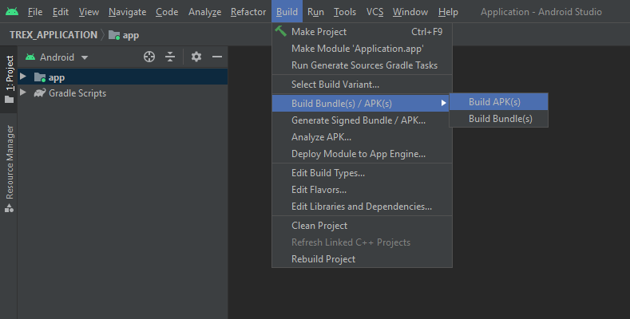
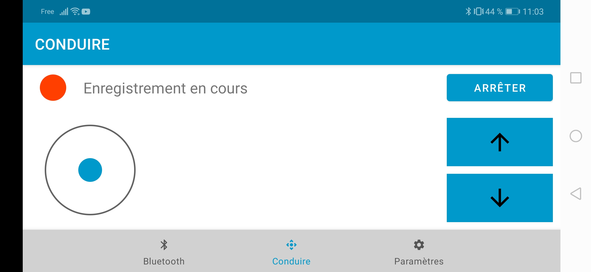

# TREX_APPLICATION
---
[TREX Embedded GPU project](https://github.com/florianwotin/TREX_PROJECT) mobile application

## Brief
Main goals of our mobile application are to connect to [robot raspberry](https://github.com/florianwotin/TREX_RASPBERRY) using bluetooth and to drive the robot. In the driving tab, you can also manage recording for [our neural network IA](https://github.com/florianwotin/TREX_IA.git).

To answer these goals, our app is made up of 3 tabs:
- [Bluetooth tab](#Bluetooth-tab)
- [Driving tab](#Driving-tab)
- [Settings tab](#Settings-tab)

Before to start the app, dont forget to read [before to start the app](#Before-to-start-the-app) and [permissions](#Permissions) sections.

When you start the app, you arrive in [bluetooth tab](#Bluetooth-tab).

## Installation
### Clone git repository on your computer

Start a terminal and go where you want to install the app in your file system.

You can install the full project with these commands:

```bash
git clone https://github.com/florianwotin/TREX_PROJECT.git
git submodule update --init --recursive
```

Or you can install only the android application with this command:

```bash
git clone https://github.com/florianwotin/TREX_APPLICATION.git
```

You can check everything is up to date with:

```bash
git status
```

### Build the APK

The next step to install the android application is to build the apk (installation program for your phone).

To achieve this purpose, we used the IDE [Android Studio](https://developer.android.com/studio) (we also used it to develop the application). You can use other tools to generate the apk, but we will detail here how to build it with [Android Studio](https://developer.android.com/studio).

1. Start Android Studio
2. Select TREX_APPLICATION repository
3. Wait all source files are loaded in the IDE, and wait initialization steps are finished.
4. Click on Build > Build Bundle(s) / APK (s) > Build APK



### Get the app on your phone

Once the APK is built, you can find it in your computer and put it in your phone filesystem (in Downloads for example to find it easily).

Then, find it, and click on it.

Once you have clicked, android will ask you to activate the possibility to install applications from external unsecure sources. Activate this permission, otherwise you won't be able to install our app from the external apk you built.

Once permissions are provided, the application will be installed on your phone and you should be able to find it with your other applications.

You can now start it when you want !

## Before to start the app

Before to start the app, ensure these prerequisites are ok:

- [Pair raspberry bluetooth device](#Pair-raspberry-bluetooth-device)

### Pair raspberry bluetooth device

In order to control TREX robot with the app, you'll have to pair raspberry bluetooth device in your phone bluetooth settings.

If raspberry is already paired to you phone, you can skip this section.

To pair raspberry bluetooth device on your phone:

1. Click Settings
2. Go in your Bluetooth Settings
3. If Bluetooth is OFF, turn it ON
4. If you can find raspberry in your paired devices, you can skip this section
5. In your available devices, click on raspberry and pair it

## Permissions

When you'll start the app, you system will ask you if you agree to provide TREX application some permissions.

Applications needs these permissions to fully work:

- BLUETOOTH
- BLUETOOTH_ADMIN

## Features
### Bluetooth tab
Bluetooth tab of our mobile application regroups all bluetooth features.
Indeed, in this tab, you can:
- See and connect paired bluetooth devices (the goal is to connect [robot raspberry](https://github.com/florianwotin/TREX_RASPBERRY))
- Make your device being discoverable by other blutooth devices
- Turn ON/OFF Bluetooth on your phone


### Driving tab
Bluetooth tab of our mobile application regroups allows you to drive the robot and to manage recording.
Indeed, in this tab, you can:

- Turn ON/OFF recording
- Drive the robot using left joystick for direction and right buttons to move forward or backward



#### Trams to move the robot

When the app starts, it also starts a thread that will send periodically trams to raspberry via Bluetooth in order to move the robot.

When you move joystick or press moving forward or moving backward button, driving parameters are updated and trams content will automatically change.

A tram to move the robot is composed of 3 bytes:

- byte 0: beginning byte **0x0F**
- byte 1: left engine value
- byte 2: right engine value

#### Trams to manage recording

When you click start or stop recording button, it will send a tram to raspberry via Bluetooth.

A tram to manage recording is composed of 3 bytes:

- byte 0: beginning byte **0x0E**
- byte 1: zero byte **0x00**
- byte 2: byte to enable (**0x01**) or disable (**0x00**) recording

### Settings tab
As indicated by its name, settings tab contains application settings.
Indeed, in this tab, you can:

- Modify maximum speed percentage of the robot using the appropriate slider.
- Modify acceleration percentage of the robot using the appripriate slider.

